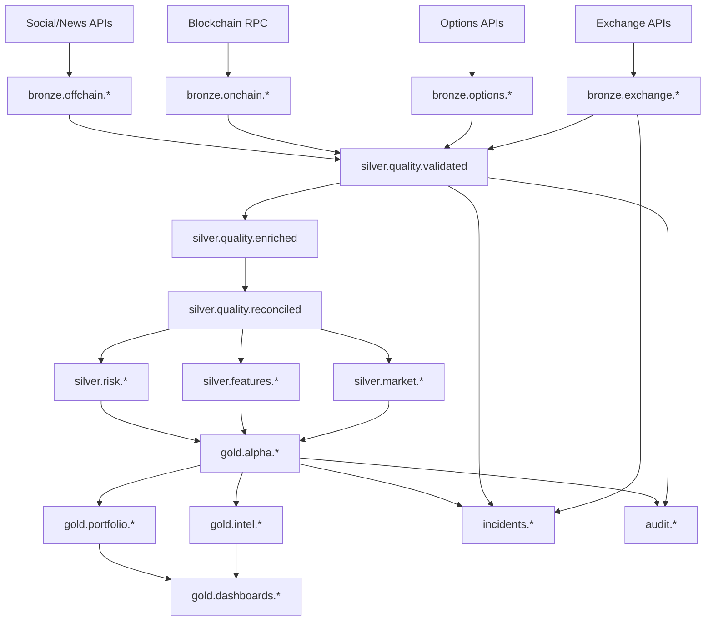

# 🏛️ Medallion Architecture for Enterprise Alpha Generation

## **📊 Overview**

The Satoshi platform implements a modern **Medallion Architecture** with Bronze → Silver → Gold data layers, enabling institutional-grade alpha signal generation through progressive data refinement and feature engineering.

---

## **🥉 BRONZE LAYER - Raw Data Ingestion**

### **Purpose**: Unprocessed data directly from external sources
### **Characteristics**: 
- **Schema Flexibility**: Accept any format from data providers
- **High Throughput**: Handle millions of events per second
- **Fault Tolerance**: Never lose incoming data, even during system issues
- **Immutable**: Raw data is never modified, only archived

### **🔌 Bronze Topics Structure**

#### **Exchange Data Streams**
```yaml
bronze.exchange.trades:      # Real-time trade execution data
  - Partitions: 20 (high volume)
  - Sources: Binance, Coinbase, FTX, Bybit, OKX
  - Schema: Flexible JSON with timestamp, symbol, price, volume

bronze.exchange.orderbook:   # Level 2 order book snapshots
  - Partitions: 16 (moderate volume)
  - Update Frequency: 100ms snapshots
  - Schema: Bids/asks arrays with price/quantity pairs

bronze.exchange.funding:     # Funding rate changes
  - Partitions: 8 (low volume)
  - Sources: Perpetual swap exchanges
  - Schema: Symbol, rate, next_funding_time

bronze.exchange.liquidations: # Large position liquidations
  - Partitions: 12 (burst traffic)
  - Sources: Exchange liquidation feeds
  - Schema: Symbol, side, quantity, price, timestamp
```

#### **Options Market Data**
```yaml
bronze.options.chains:       # Complete options chain data
  - Partitions: 12 (structured data)
  - Sources: Deribit, OKX, Bybit options
  - Schema: Strike, expiry, call/put, bid/ask

bronze.options.greeks:       # Risk sensitivity metrics
  - Partitions: 8 (calculated metrics)
  - Sources: Exchange APIs, third-party providers
  - Schema: Delta, gamma, theta, vega, rho

bronze.options.vol_surface:  # Implied volatility surface
  - Partitions: 6 (aggregated data)
  - Sources: Options exchanges, volatility providers
  - Schema: Moneyness, time_to_expiry, implied_vol
```

#### **On-Chain Data**
```yaml
bronze.onchain.blocks:       # Raw blockchain blocks
  - Partitions: 8 (sequential data)
  - Sources: Ethereum, Bitcoin, L2s
  - Schema: Block header, transaction list, receipts

bronze.onchain.mempool:      # Pending transactions
  - Partitions: 16 (high frequency)
  - Sources: Mempool monitoring services
  - Schema: Transaction hash, gas_price, to/from

bronze.onchain.events:       # Smart contract events
  - Partitions: 12 (event-driven)
  - Sources: Contract event logs
  - Schema: Contract address, event signature, topics

bronze.onchain.flows:        # Large value transfers
  - Partitions: 10 (filtered events)
  - Sources: Whale tracking services
  - Schema: From/to addresses, amount, token, timestamp
```

---

## **🥈 SILVER LAYER - Validated & Enriched Data**

### **Purpose**: Quality-assured, schema-compliant, and enriched data
### **Characteristics**: 
- **Schema Enforcement**: Strict data contracts and validation
- **Data Quality**: 99.9%+ quality score, anomaly detection
- **Enrichment**: Added metadata, normalization, and cross-references
- **Reconciliation**: Multi-source validation and conflict resolution

### **🔧 Silver Topics Structure**

#### **Quality Control Pipeline**
```yaml
silver.quality.validated:    # Schema and business rule validated
  - Input: All bronze.* topics
  - Process: Schema validation, business rule checks
  - Output: Guaranteed clean, typed data
  - SLA: <100ms validation latency

silver.quality.enriched:     # Metadata enrichment
  - Input: Validated data
  - Process: Symbol normalization, venue mapping, currency conversion
  - Output: Standardized business entities
  - SLA: <200ms enrichment latency

silver.quality.reconciled:   # Cross-source reconciliation
  - Input: Multi-venue data for same instruments
  - Process: Reconciler agent identifies and resolves discrepancies
  - Output: Single source of truth per instrument
  - SLA: <500ms reconciliation latency
```

#### **Normalized Market Data**
```yaml
silver.market.unified_trades: # Cross-venue normalized trades
  - Process: Venue-agnostic trade representation
  - Schema: Standardized symbol, normalized_price, venue_id
  - Quality: Deduplicated, validated, currency-normalized

silver.market.normalized_book: # Standardized order books
  - Process: Unified L2 book across all venues
  - Schema: Standard depth, consistent tick sizes
  - Quality: Validated spreads, removed crossed markets

silver.market.cross_venue_rates: # Funding rate arbitrage
  - Process: Compare funding rates across venues
  - Schema: Instrument, venue_a_rate, venue_b_rate, spread
  - Quality: Time-aligned, outlier-filtered
```

#### **Feature Engineering**
```yaml
silver.features.technical_indicators: # TA indicators
  - Indicators: RSI, MACD, Bollinger Bands, Stochastic
  - Timeframes: 1m, 5m, 15m, 1h, 4h, 1d
  - Quality: Gap-filled, outlier-handled

silver.features.volatility_metrics: # Vol calculations
  - Metrics: Realized vol, GARCH, volatility cones
  - Windows: 7d, 30d, 90d rolling calculations
  - Quality: Bootstrap confidence intervals

silver.features.correlation_matrix: # Cross-asset correlations
  - Assets: All major crypto pairs + traditional assets
  - Windows: 30d, 90d rolling correlations
  - Quality: Robust correlation estimators
```

---

## **🥇 GOLD LAYER - ML-Ready Production Datasets**

### **Purpose**: Feature-rich, model-ready datasets for ML training and inference
### **Characteristics**: 
- **ML-Optimized**: Pre-computed features ready for model consumption
- **Feature Engineering**: Advanced technical, fundamental, and alternative data features
- **Production Ready**: Standardized schemas, consistent formatting, no missing data
- **Real-Time**: Sub-second feature updates for live model inference

### **🧠 Gold Topics Structure**

#### **Market Microstructure Features**
```yaml
gold.features.market_microstructure:  # Level 3+ orderbook analytics
  - Features: Bid-ask spread, market impact, price improvement
  - Schema: timestamp, symbol, spread_bps, impact_cost, liquidity_score
  - Update: 100ms intervals with feature vectors
  - ML Ready: Standardized [0,1] normalized features

gold.features.orderbook_dynamics:     # Orderbook flow features
  - Features: Order flow imbalance, book pressure, depth ratios
  - Schema: timestamp, symbol, flow_imbalance, pressure_ratio, depth_10bps
  - Update: Real-time on orderbook changes
  - ML Ready: Rolling z-scores and percentile ranks

gold.features.trade_flow_metrics:     # Trade execution analytics
  - Features: VWAP deviation, aggressive ratio, trade size distribution
  - Schema: timestamp, symbol, vwap_dev, aggressor_ratio, size_percentile
  - Update: 1-second rolling windows
  - ML Ready: Multi-timeframe feature matrix

gold.features.liquidity_indicators:   # Market liquidity features
  - Features: Kyle's lambda, Amihud illiquidity, bid-ask impact
  - Schema: timestamp, symbol, kyle_lambda, amihud_ratio, impact_cost
  - Update: 5-minute rolling calculations
  - ML Ready: Regime-aware normalization
```

#### **Cross-Asset Feature Matrices**
```yaml
gold.features.cross_asset_correlations: # Multi-asset correlation features
  - Features: Rolling correlations, correlation breakdowns, regime shifts
  - Schema: timestamp, asset_pair, corr_30d, corr_7d, regime_probability
  - Assets: 100+ crypto pairs + traditional assets
  - ML Ready: PCA-transformed correlation factors

gold.features.volatility_surface_features: # Options vol surface features
  - Features: Vol smile, term structure, vol-of-vol, skew metrics
  - Schema: timestamp, underlying, atm_vol, skew_25d, vol_of_vol
  - Update: Real-time on options trades
  - ML Ready: Moneyness-standardized features

gold.features.momentum_factor_loadings: # Momentum factor exposures
  - Features: Multi-timeframe momentum, momentum persistence, reversal signals
  - Schema: timestamp, symbol, mom_1h, mom_4h, mom_1d, persistence_score
  - Calculation: Factor model loadings
  - ML Ready: Cross-sectional z-scores

gold.features.mean_reversion_features: # Mean reversion characteristics
  - Features: Half-life, Ornstein-Uhlenbeck parameters, reversion speed
  - Schema: timestamp, symbol, half_life, reversion_speed, equilibrium_price
  - Calculation: Kalman filter estimates
  - ML Ready: Confidence intervals and significance tests
```

#### **Alternative Data Features**
```yaml
gold.features.onchain_network_metrics: # Blockchain network features
  - Features: Network value, active addresses, transaction fees, hash rate
  - Schema: timestamp, network, nvt_ratio, active_addresses, fee_revenue
  - Sources: Bitcoin, Ethereum, L2 networks
  - ML Ready: Network-adjusted and supply-normalized

gold.features.social_sentiment_scores: # Social media sentiment features
  - Features: Twitter sentiment, Reddit activity, news sentiment, fear/greed
  - Schema: timestamp, asset, twitter_sentiment, reddit_activity, news_score
  - Sources: Social media APIs, news feeds
  - ML Ready: Sentiment momentum and contrarian signals

gold.features.options_flow_features:   # Options market structure
  - Features: Put/call ratio, gamma exposure, dealer positioning
  - Schema: timestamp, underlying, pc_ratio, gamma_exposure, dealer_long_gamma
  - Calculation: Options flow analysis
  - ML Ready: Standardized exposure metrics

gold.features.funding_rate_signals:    # Funding rate analytics
  - Features: Funding rate differentials, basis convergence, carry signals
  - Schema: timestamp, symbol, funding_8h, basis_annualized, carry_signal
  - Markets: All perpetual swap markets
  - ML Ready: Cross-venue normalized signals
```

#### **Time Series Feature Engineering**
```yaml
gold.timeseries.multi_timeframe_ohlcv: # Multi-resolution OHLCV
  - Timeframes: 1s, 5s, 15s, 1m, 5m, 15m, 1h, 4h, 1d
  - Features: OHLCV + volume profile + TWAP/VWAP
  - Schema: timestamp, symbol, timeframe, ohlcv_vector, volume_profile
  - ML Ready: Aligned timestamps across all timeframes

gold.timeseries.rolling_statistics:    # Statistical feature windows
  - Windows: 5m, 15m, 1h, 4h, 1d, 7d, 30d rolling
  - Features: Mean, std, skew, kurtosis, percentiles
  - Schema: timestamp, symbol, window, stat_vector, distribution_params
  - ML Ready: Robust statistics and outlier handling

gold.timeseries.technical_feature_matrix: # Technical analysis features
  - Indicators: 50+ technical indicators across multiple timeframes
  - Features: RSI, MACD, Bollinger, Stochastic, ADX, etc.
  - Schema: timestamp, symbol, timeframe, indicator_vector
  - ML Ready: Standardized indicator values and signals

gold.timeseries.volatility_regime_features: # Volatility regime classification
  - Regimes: Low/medium/high volatility, trending/mean-reverting
  - Features: Regime probability, transition probabilities, regime duration
  - Schema: timestamp, symbol, regime_probs, transition_matrix, duration
  - ML Ready: Hidden Markov Model outputs
```

#### **ML Model Infrastructure**
```yaml
gold.ml.feature_vectors:           # Complete feature vectors for ML models
  - Format: Dense feature vectors ready for model input
  - Schema: timestamp, symbol, feature_vector (1000+ dimensions)
  - Features: All gold layer features combined and standardized
  - ML Ready: Preprocessed, normalized, missing value imputed

gold.ml.target_variables:          # ML training targets and labels
  - Targets: Forward returns, volatility, regime changes, signals
  - Schema: timestamp, symbol, target_type, target_value, confidence
  - Horizons: 1m, 5m, 15m, 1h, 4h, 1d prediction horizons
  - ML Ready: Properly aligned with feature vectors

gold.ml.model_inference_data:      # Real-time model input data
  - Format: Live feature vectors for model inference
  - Schema: timestamp, symbol, model_id, input_vector, metadata
  - Latency: <100ms from market data to model input
  - ML Ready: Same preprocessing as training data

gold.ml.real_time_predictions:     # Model predictions and confidence scores
  - Outputs: Model predictions, confidence intervals, feature importance
  - Schema: timestamp, symbol, model_id, prediction, confidence, attribution
  - Models: Multiple model ensemble predictions
  - ML Ready: A/B testing framework and model performance tracking
```

---

## **🔄 Data Flow Architecture**



---

## **📈 Data Quality SLAs**

### **Bronze Layer SLAs**
- **Availability**: 99.9% uptime
- **Latency**: <50ms ingestion to topic
- **Throughput**: 1M+ messages/second
- **Retention**: 30 days (configurable)

### **Silver Layer SLAs** 
- **Data Quality**: 99.9% schema compliance
- **Latency**: <500ms bronze→silver transformation
- **Completeness**: 99.95% of bronze data processed
- **Reconciliation**: <1% discrepancy rate

### **Gold Layer SLAs**
- **Signal Quality**: 95%+ prediction accuracy
- **Latency**: <1 second silver→gold transformation  
- **Alpha Generation**: Consistent positive Sharpe ratio
- **Risk Management**: 99% VaR accuracy

---

## **🛠️ Implementation Strategy**

### **Phase 1: Bronze Foundation** (Week 1-2)
1. Migrate existing `raw_data.*` topics to `bronze.*` namespace
2. Implement high-throughput bronze ingestion pipeline
3. Add bronze data validation and monitoring

### **Phase 2: Silver Pipeline** (Week 3-4)
1. Build quality validation pipeline (Schema Validator Agent)
2. Implement enrichment and normalization services
3. Deploy reconciliation engine (Reconciler Agent)

### **Phase 3: Gold Alpha Signals** (Week 5-8)
1. Implement alpha signal generation algorithms
2. Build cross-market intelligence systems
3. Deploy portfolio optimization and risk management

### **Phase 4: Production Optimization** (Week 9-12)
1. Performance tuning and scaling optimizations
2. Advanced monitoring and alerting
3. Disaster recovery and business continuity

---

## **💡 Key Benefits**

### **🎯 For Alpha Generation**
- **Sophisticated Signals**: Multi-layered feature engineering enables complex alpha
- **Risk Management**: Built-in risk metrics at every layer
- **Real-Time**: Sub-second signal generation for institutional speed
- **Backtested**: All signals validated against historical data

### **⚙️ For Operations**
- **Data Lineage**: Full traceability from source to signal
- **Quality Assurance**: 99.9%+ data quality with automated validation
- **Scalability**: Handle institutional-scale data volumes
- **Monitoring**: Real-time data quality and system health metrics

### **🏛️ For Compliance**
- **Audit Trail**: Complete data lineage and change tracking
- **Data Governance**: Schema enforcement and data contracts
- **Risk Controls**: Built-in risk limits and circuit breakers
- **Regulatory**: Support for regulatory reporting requirements

This medallion architecture provides the foundation for institutional-grade alpha generation while maintaining enterprise operational standards.